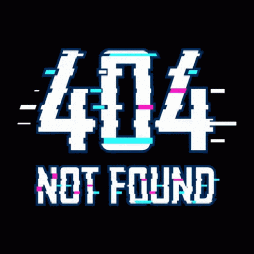

# Salva Lozano

## (ツ) Descripción  

Soy estudiante de informática y actualmente estoy terminando DAW. 
Para hablar un poco sobre mí, me encanta patinar, viajar, jugar videojuegos y actualmente estoy en el proceso de comenzar a aprender a tocar el piano.

---

> "Just because you see a smile don't you think you know what's going on underneath, a smile is a valuable tool my dear, it inspires youre friends, keeps your enemies guessing, and insures no matter what happens in your way, your the one in control."  
>  
> **- Alastor**

---
## 📖 Educación

- *2023-Presente* Grado superior DAM (Desarrollo de Aplicaciones Multiplataforma)
- *2021-2023* Grado medio SMX (Sistemas Microinformáticos y Redes)
- *2018-2021* ESO (Educación Secundaria Obligatoria), Picanya

## 🚀💻 Habilidades informáticas

- Lenguajes de programación: Java, Python, Bash, PowerShell y Kodlin (actualmente aprendiendo).
- Lenguaje de composición tipográfico: Markdown.
- Entorno de programación: Visual Studio Code.

<br>

<div align="center">
	
</div>

## 🚀🙍‍♂️ Habilidades personales

- Paciencia a la hora de realizar tareas
- Curiosidad por aprender y mejorar
- Comunicación asertiva
- Trabajo en equipo

<br>

## ⚙️ Ejercicio de Angel 1 SMX
```bash

#!/bin/bash

TOTAL=0
ACUMULABLE=0

while [ $TOTAL -lt 100 ]; do
	echo " Dime un número a sumarle a TOTAL : "
	read NUMERO
	let TOTAL=$TOTAL+$NUMERO
	echo " Total vale ahora : $TOTAL "
	let ACUMULABLE=$ACUMULABLE+1
done
	
	echo " "
	echo " -- Por fin! $TOTAL es mas grande que 100 -- "
	echo " "
	echo " -- El bucle se ha ejecutado $ACUMULABLE veces -- "

exit 0

```

<br>

<div align="center">
	&nbsp;&nbsp;&nbsp;&nbsp;&nbsp;&nbsp;&nbsp;
	&nbsp;&nbsp;&nbsp;&nbsp;&nbsp;&nbsp;&nbsp;
	&nbsp;&nbsp;&nbsp;&nbsp;&nbsp;&nbsp;&nbsp;
</div>

<!--
**Leo30Salva/Leo30Salva** is a ✨ _special_ ✨ repository because its `README.md` (this file) appears on your GitHub profile.

Here are some ideas to get you started:

- 🔭 I’m currently working on ...

- 🌱 I’m currently learning ...
- 👯 I’m looking to collaborate on ...
- 🤔 I’m looking for help with ...
- 💬 Ask me about ...
- 📫 How to reach me: ...
- 😄 Pronouns: ...
- ⚡ Fun fact: ...
-->
